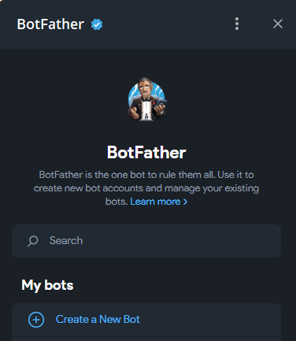
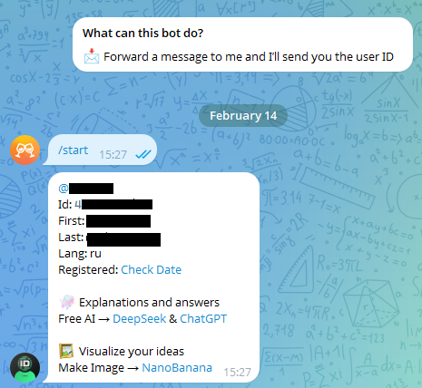

## Инструкция настройке Telegram бота  

Данная инструкция поможет вам получить: 
 
 - **токен** (ключ доступа к боту) 
 - **chat_id** (идентифкатор чата в который бот будет присылать сообщение).

Эти данные нужны для настройки бота.  

---  
### Шаг 1: Создайте бота в Telegram  
1. Откройте Telegram и найдите бота @BotFather (это официальный бот для создания ботов).  
2. Нажмите "Open" и выберите "Create a New Bot".

3. @BotFather попросит ввести **имя бота** и **никнейм бота** (никнейм должен заканчиваться на `bot`, например, `my_ssvc_oc_bot`).

4. Если имя свободно, @BotFather сгенерирует **токен** (длинная строка из цифр и букв, например, `123456:ABC-DEF1234ghIkl-zyx57W2v1u123ew11`).  

5. Сохраните этот токен. Он понадобится для управления ботом.  

---  
## Шаг 2. Получение chat_id (вашего Id в Telegram)  

1. Найдите в Telegram бота **@userinfobot** и нажмите **«Запустить»** (Start).  
2. Бот автоматически пришлет ваш **Id** (это число, например, `123456789`).  

3. Сохраните этот **Id**. Он понадобится для отправки сообщений.

---
## Шаг 3. Настройка SSVC_OpenConnect

TODO